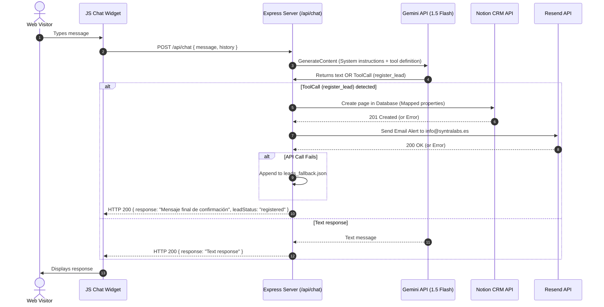

# Design: AI Agent Integration

## Technical Approach
This design implements a client-server architecture. The frontend is a vanilla JS/CSS chat widget embedded via a single script tag. The backend is a Node.js Express server that manages session state, queries the Gemini LLM (using system prompt context and tool-calling for lead extraction), pushes leads to Notion CRM, sends email alerts via Resend, and logs failures locally to `leads_fallback.json`.

---

## Architecture Decisions

| Option | Tradeoffs | Decision |
| :--- | :--- | :--- |
| **Lead Collection Strategy** | **A:** HTML form overlay.<br>**B:** Conversational qualification via LLM Tool/Function Call. | **Choice: B.** Conversational tool-calling maintains a premium 24/7 AI agent experience while guaranteeing structured data extraction. |
| **LLM Provider** | **A:** OpenAI GPT-4o-mini.<br>**B:** Gemini 1.5 Flash. | **Choice: B.** Gemini 1.5 Flash provides lower latency, higher speed, and lower costs for real-time web chat. |
| **API Outage Fallback** | **A:** Retry queue in memory.<br>**B:** Append-only JSON file fallback (`leads_fallback.json`). | **Choice: B.** Prevents loss of lead data across server restarts and crashes. |

---

## Data Flow



---

## File Changes

| File | Action | Description |
| :--- | :--- | :--- |
| `package.json` | Modify | Add `@google/generative-ai`, `@notionhq/client`, `resend`, `express`, and `dotenv`. |
| `src/server/index.js` | Create | Core Express server, routing middleware, and environment configurations. |
| `src/server/controllers/chat.controller.js` | Create | Handles `/api/chat`, structures LLM prompts, parses function-calling responses. |
| `src/server/controllers/lead.controller.js` | Create | Handles `/api/lead` (manual submission endpoint) and lead processing logic. |
| `src/server/services/notion.service.js` | Create | Formats and sends payload to Notion API. Handles errors. |
| `src/server/services/resend.service.js` | Create | Formats HTML template and calls Resend API to notify sales. |
| `src/server/services/fallback.service.js` | Create | Appends failing leads into `leads_fallback.json` securely with timestamps. |
| `src/widget/widget.js` | Create | Client-side class managing the floating widget DOM, message stream, and API fetches. |
| `src/widget/widget.css` | Create | Styling for the widget (glassmorphic theme, typography, layout, animations). |

---

## Interfaces / Contracts

### `/api/chat` Response Types
```typescript
interface ChatRequest {
  message: string;
  history: Array<{ role: 'user' | 'model'; parts: string }>;
}

interface ChatResponse {
  response: string;
  leadStatus?: 'registered' | 'failed' | 'none';
}
```

### Lead Registration Tool Definition (LLM-side)
```json
{
  "name": "register_lead",
  "description": "Registers a qualified lead when Name, Company, Email, Phone, Goals, and Timeframe are collected.",
  "parameters": {
    "type": "OBJECT",
    "properties": {
      "name": { "type": "STRING" },
      "company": { "type": "STRING" },
      "email": { "type": "STRING" },
      "phone": { "type": "STRING" },
      "website": { "type": "STRING", "description": "Current website URL if exists" },
      "sector": { "type": "STRING" },
      "goals": { "type": "STRING", "enum": ["Más clientes", "Más ventas", "Automatización", "Mejor imagen digital", "Otro"] },
      "timeframe": { "type": "STRING", "enum": ["Inmediatamente", "Este mes", "Próximos 3 meses"] }
    },
    "required": ["name", "company", "email", "phone", "goals", "timeframe"]
  }
}
```

### Notion CRM Data Mapping
```javascript
const notionPayload = {
  parent: { database_id: process.env.NOTION_DATABASE_ID },
  properties: {
    "Nombre": { title: [{ text: { content: lead.name } }] },
    "Empresa": { rich_text: [{ text: { content: lead.company } }] },
    "Teléfono": { phone_number: lead.phone },
    "Email": { email: lead.email },
    "Página web actual": { url: lead.website || null },
    "Sector": { rich_text: [{ text: { content: lead.sector || "" } }] },
    "Servicio solicitado": { select: { name: lead.service || "Otro" } },
    "Estado comercial": { status: { name: "NUEVO LEAD" } },
    "Origen del lead": { select: { name: "Agente IA" } },
    "Observaciones": { rich_text: [{ text: { content: `Objetivos: ${lead.goals}\nPlazo: ${lead.timeframe}` } }] }
  }
};
```

---

## Testing Strategy

| Layer | What to Test | Approach |
| :--- | :--- | :--- |
| **Unit** | Service payload formatting & prompt construction. | Test helper functions in isolation using Vitest/Jest. |
| **Integration** | Notion/Resend failures fallback mechanism. | Mock external API errors to assert `leads_fallback.json` creation/updates. |
| **E2E** | Conversational flow lead extraction. | Run a local instance and simulate complete conversation to verify automated tool triggers. |

---

## Migration / Rollout
No migration is required as this is a greenfield integration. Rollout steps:
1. Provision the Notion Database using the schema defined above.
2. Deploy the Express backend and configure `.env` with API keys (`GEMINI_API_KEY`, `NOTION_TOKEN`, `NOTION_DATABASE_ID`, `RESEND_API_KEY`).
3. Include `<script src="/js/widget.js" defer></script>` in the web templates.

---

## Open Questions
- [ ] Should we support multiple Notion statuses or defaults beyond "NUEVO LEAD"?
- [ ] Is there an existing verified domain in Resend, or will we use the default sandbox email for initial testing?
